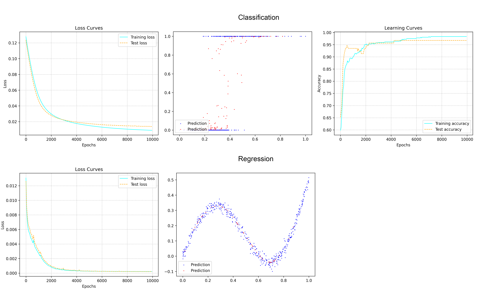
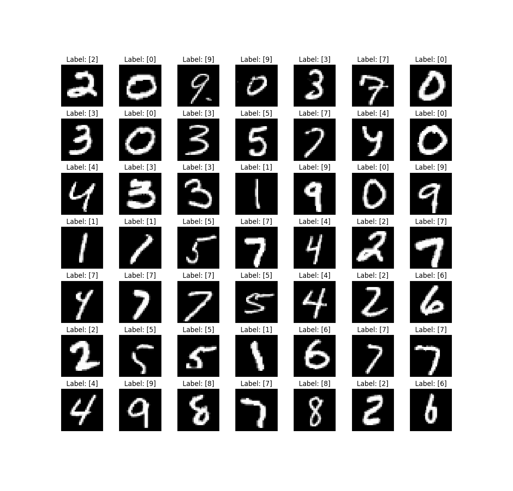
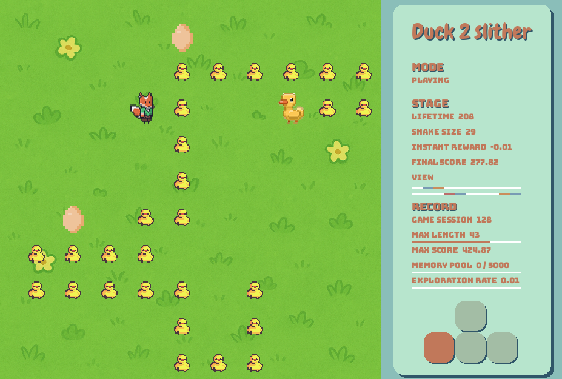

# zero2ml

**zero2ml** is a **practice project** to learn machine learning **from zero**,  
by re-implementing fundamental machine learning algorithms.

The purpose of this repository is to understand how classic ML models work internally.

---

## Highlights

- **From Zero** → Starting from no external ML frameworks, everything implemented from scratch
- **Educational** → designed as a step-by-step learning exercise  
- **Modularity** → designed as encapsulated classes, can be reused in different projects.

---

## Current Progress

- [x] Python for data science
- [x] Linear Regression (main algo with Rust)  
- [x] Logistic Regression (One-vs-all approach)
- [x] Multilayer Perceptron (Neural Network from Scratch)
- [x] Convolutional Neural Network (Implemented with Pytorch)
- [x] Deep Q Neural Network (From Scratch with Numpy)
- [On going] Resnet
- [ ] Transformer
- [ ] More to come... 


## Requirements

These projects are mainly built with Python, while a few use Rust. Therefore, some dependencies are required.  

Each project includes a `venv.sh` and `requirements.txt` to help you set up a virtual environment and install the necessary packages:  

```bash
bash venv.sh
source venv/bin/activate
```


## Projects

### 0. Python for Data Science ✅

This module is part of the 42 curriculum (“Python for Data Science”) and is designed to introduce Python in the context of data science.  
It covers the fundamentals of Python programming and gradually applies them to data processing and analysis tasks.  

Main topics include:  
- Python basics: syntax, data structures, control flow, and package management  
- Arrays and matrix operations, as well as image manipulation exercises using NumPy  
- Data processing and visualization (e.g., CSV handling, plotting) with Pandas and Matplotlib  
- Object-oriented programming with modular design and inheritance
- Exploring statistics, and advanced Python features such as decorators and closures

This module builds the foundation for later machine learning projects.  


[[Python for Data Science full repo]](https://github.com/swangarch/python_piscine)


### 1. Linear Regression ✅

The goal of this project is to predict car prices based on their mileage, as these two factors have a linear correlation.
As an introduction to machine learning, gradient descent is used to minimize the loss function (MSE) in order to find the 
appropriate values of θ₀ and θ₁. These two parameters are updated simultaneously during the process, allowing the loss 
function to descend in the steepest direction.

Linear regression is implemented with three programs, main algorithm is implemented with Rust, visualizer with python.


[[Linear Regression repo]](https://github.com/swangarch/linear_regression)

---

### 2. Data Science X Logistic Regression ✅

Logistic regression is usually used for binary classification tasks, this project applies a one-vs-all strategy to handle the multi-class setting. The implementation is highly modular and encapsulated, so the same class can be reused for other datasets. 

This project also includes a data science part with analysis and visualization to give a better intuition to help understanding the dataset.


[[DSLR repo]](https://github.com/swangarch/data_science_logistic_regression)

---

### 3. Multilayer Perceptron (Neural Network) ✅

Multilayer Perceptron (Neural Network) is implemented entirely from scratch without relying on high-level machine learning libraries, using only NumPy for matrix operations, capable of handling both regression and classification tasks. The implementation supports flexible training methods, including Stochastic Gradient Descent (SGD) and mini-batch training, and provides configurable architecture options such as network structure, activation functions, learning rate, batch size, and maximum iterations. In addition, it features a built-in data loading and preprocessing pipeline, as well as real-time visualization with learning process animations.



[[MLP repo]](https://github.com/swangarch/multilayer_perceptron)

---

### 4. Convolutional Neural Network (CNN) ✅

This project implements a simple Convolutional Neural Network (CNN) framework with PyTorch, to perform hand write digit recognition.



[[CNN repo]](https://github.com/swangarch/convolutional_neural_network)

---

### 5. Deep Q Network (DQN) ✅

A reinforcement learning project that trains an AI agent to play the classic Snake game using a Deep Q-Network (DQN) implemented from scratch, only using numpy.



[[DQN repo]](https://github.com/swangarch/learn2slither)

---

## 🎯 Goal

By the end of this project, the repository will contain:  
1. A minimal set of ML algorithms.  
2. Python scripts & notebooks for visualizing training results  
3. A clean and educational codebase that shows **how ML works under the hood**


## License
This project is licensed under the MIT License - see the [LICENSE](LICENSE) file for details.
