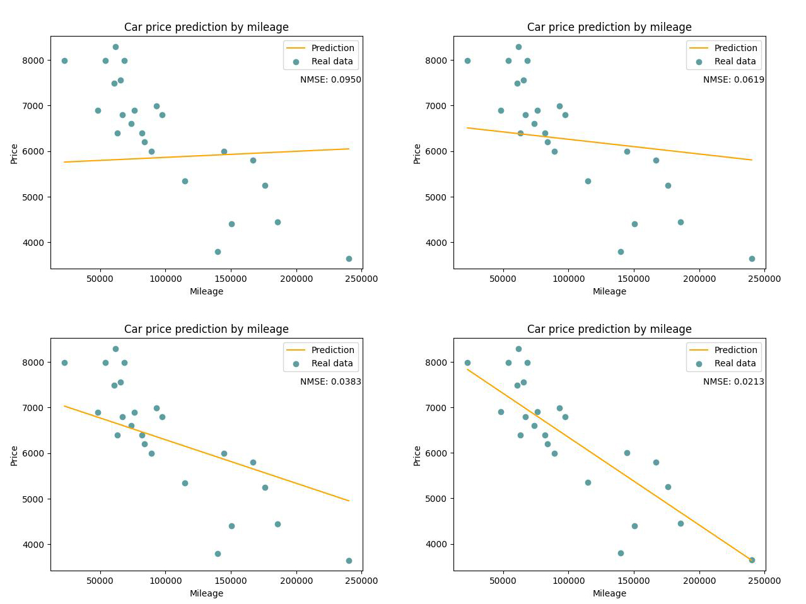
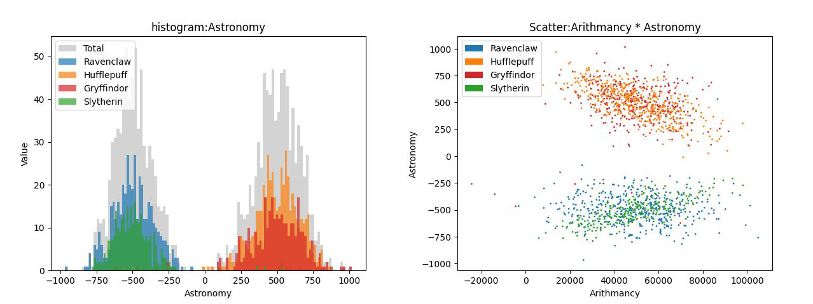
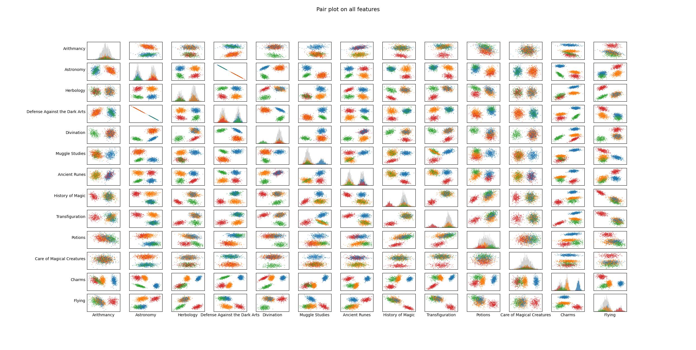
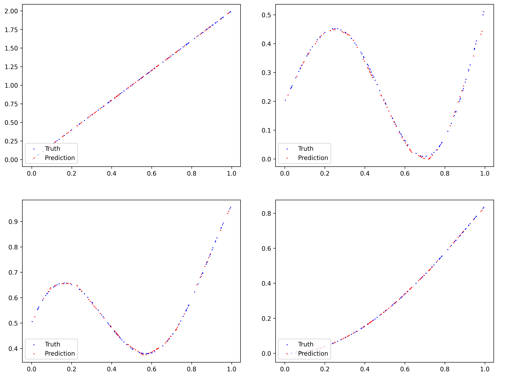

# zero2ml

**zero2ml** is a **practice project** to learn machine learning **from zero**,  
by re-implementing fundamental machine learning algorithms.

The purpose of this repository is **educational**:  
to understand how classic ML models work internally.

---

## ✨ Highlights

- **From Zero** → no external ML frameworks, everything implemented from scratch  
- **Educational** → designed as a step-by-step learning exercise  
- **Modularity** → designed as encapsulated classes, can be reused in different projects.

---

## 📌 Current Progress

- [x] Linear Regression (main algo with Rust)  
- [x] Logistic Regression
- [x] Neural Network
- [ ] Multilayer Perceptron (planned)
- [ ] More to come... 🚀


### 1. Linear Regression ✅

Linear regression is implemented with three programs, main algorithm is implemented with Rust, visualizer with python:

#### 📖 Programs

1. **Predictor**  
   - Usage:  
     ```
     cargo run <weight.txt>
     ```  
   - Reads model parameters from `weight.txt`.  
   - If no `weight.txt` is available, it uses default weights `(0, 0)`.  
   - Outputs the predicted price for the given `km` value.  

2. **Trainer**  
   - Usage:  
     ```
     cargo run <data.csv>
     ```  
   - Takes a CSV file containing training data (`km`, `price`).  
   - Trains the linear regression model using gradient descent.  
   - Saves the final model parameters into `weight.txt`.  

3. **Visualizer**  
   - Usage:  
     ```
     python visualize.py <path_to_training_program> <path_to_data_csv>
     ```  
   - Runs the Rust training program, collects the results,  
     and visualizes the training process and regression line using Python (matplotlib).  

   

---

### 2. Logistic Regression ✅

This project builds a generalized logistic regression classifier in python to predict a Hogwarts house based on student features.

Logistic regression is usually used for binary classification tasks, this project applies a one-vs-all strategy to handle the 
multi-class setting. The implementation is highly modular and encapsulated, so the same class can be reused for other datasets. 
Thus, it serves as a flexible solution for general multi-class linear classification problems.

This project also includes a data science part with analysis and visualization to better understand the dataset.

#### 📖 Programs  

0. **Describer**  
   - Usage:  
     ```bash
     python describe.py <data.csv>
     ```  
   - Describe the training dataset.  

1. **Visualizer**  
   - Usage:  
     ```bash
     python histogram.py <data.csv>
     python scatter_plot.py <data.csv>
     python pair_plot.py <data.csv>
     ```  
   - Plots the training dataset with histogram, and scatter plot.  
   - Displays intuitively the distribution of data. 

   
   

2. **Trainer**  
   - Usage:  
     ```bash
     python logreg_train.py <dataset_train.csv>
     ```  
   - Takes a CSV dataset with labeled classes.  
   - Trains the logistic regression model using gradient descent.  
   - Saves the trained weights into `data/weights.txt`.  

3. **Predictor**  
   - Usage:  
     ```bash
     python logreg_predict.py <dataset_train.csv> <dataset_test.csv> <weights.txt>
     ```  
   - Loads trained weights from `weights.txt`.  
   - Predicts class probabilities for given test samples.  
   - Outputs predicted class (0 or 1).
   - One-vs-all tasks with multi models training.


---

### 3. Neural Network ✅

Neural Network is implemented as an encapsulated class in Python,  
capable of solving both regression and classification tasks.  
The design goal is to provide a reusable and modular implementation.

#### 📖 Programs  

1. **Train and Predict**  
   - Usage:  
     ```bash
     python main.py
     ```  
   - Defines the network structure (layers, activation functions).  
   - Trains using backpropagation and gradient descent.  
   - Visualize loss and prediction.  


2. **Class example** 

#### 📘 Example: Train and Test a Neural Network

Below is a simple example of using the `NN` class to train a regression model.

```python
from utils.activation_func import relu, sigmoid
from utils.data_generation import generate_data_1d
from utils.nnClass import NN


def main():
    try:
        # Define network structure: input → 64 → 32 → output
        net_shape = (1, 64, 32, 1)
        activation_funcs = (relu, relu, None)  # last layer is linear (regression)

        # Initialize neural network
        nn = NN(net_shape, activation_funcs)

        # Generate training data
        inputs, truths = generate_data_1d(142, 100)
        nn.train(inputs, truths, max_iter=20000, learning_rate=0.05)

        # Test with new data
        test_inputs, test_truths = generate_data_1d(123, 80)
        nn.test(test_inputs, test_truths)

        # Show loss curve
        nn.show_loss()

    except Exception as e:
        print("Error:", e)


if __name__ == "__main__":
    main()
```




---

## 🎯 Goal

By the end of this project, the repository will contain:  
1. A minimal set of ML algorithms.  
2. Python scripts & notebooks for visualizing training results  
3. A clean and educational codebase that shows **how ML works under the hood**
