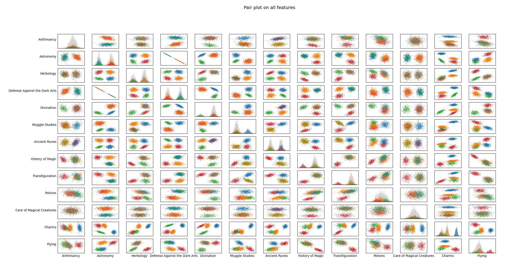

# zero2ml

**zero2ml** is a **practice project** to learn machine learning **from zero**,  
by re-implementing fundamental machine learning algorithms.

The purpose of this repository is to understand how classic ML models work internally.

---

## ✨ Highlights

- **From Zero** → no external ML frameworks, everything implemented from scratch  
- **Educational** → designed as a step-by-step learning exercise  
- **Modularity** → designed as encapsulated classes, can be reused in different projects.

---

## 📌 Current Progress

- [x] Python for data science
- [x] Linear Regression (main algo with Rust)  
- [x] Logistic Regression
- [x] Neural Network
- [ ] More to come... 🚀


## 📌 Requirements

These projects are mainly built with Python, while a few use Rust. Therefore, some dependencies are required.  

Each project includes a `venv.sh` and `requirements.txt` to help you set up a virtual environment and install the necessary packages:  

```bash
bash venv.sh
source venv/bin/activate
```

Note: The projects were developed on linux (ubuntu).
If you are using WSL, some visualization scripts may not work properly due to the lack of GUI support.


## 📌 Projects

### 0. Python for Data Science ✅

This module is part of the 42 curriculum (“Python for Data Science”) and is designed to introduce Python in the context of data science.  
It covers the fundamentals of Python programming and gradually applies them to data processing and analysis tasks.  

Main topics include:  
- Python basics: syntax, data structures, control flow, and package management  
- Arrays and matrix operations, as well as image manipulation exercises using NumPy  
- Data processing and visualization (e.g., CSV handling, plotting) with Pandas and Matplotlib  
- Object-oriented programming with modular design and inheritance
- Exploring statistics, and advanced Python features such as decorators and closures

This module builds the foundation for later machine learning projects.  
👉 [The full “Python for Data Science” repo](https://github.com/swangarch/python_piscine)


### 1. Linear Regression ✅

The goal of this project is to predict car prices based on their mileage, as these two factors have a linear correlation.
As an introduction to machine learning, gradient descent is used to minimize the loss function (MSE) in order to find the 
appropriate values of θ₀ and θ₁. These two parameters are updated simultaneously during the process, allowing the loss 
function to descend in the steepest direction.

Linear regression is implemented with three programs, main algorithm is implemented with Rust, visualizer with python:

#### Methodology

Linear regression is one of the most fundamental algorithms in machine learning. The idea is to model the relationship between an input variable (mileage) and an output variable (price) with a straight line:

$$
\hat{y} = \theta_0 + \theta_1 x
$$

where $\hat{y}$ is the predicted car price, $x$ is the mileage, and $\theta_0, \theta_1$ are parameters to be learned.

#### Regression:

The regression problem can be seen as finding the best-fitting line that minimizes the difference between the predicted values $\hat{y}$ and the true values $y$.

#### Normalization:

Since features may vary in scale, normalization ensures that all input data are on a comparable range. This speeds up convergence during gradient descent and prevents one feature from dominating the others.

#### Loss function(Mean Squared Error, MSE):

The loss function measures how well our line fits the data:

$$
J(\theta_0, \theta_1) = \frac{1}{2m}\sum_{i=1}^m \big(\hat{y}^{(i)} - y^{(i)}\big)^2
$$

where $m$ is the number of training examples. The goal is to minimize this loss.

#### Gradient Derivation (using the Chain Rule)

We want to compute the gradient of the loss with respect to each parameter.  

Start from the loss function for a single sample:  

$$
L^{(i)} = \frac{1}{2}\Big(\hat{y}^{(i)} - y^{(i)}\Big)^2
$$  

Differentiate with respect to $\hat{y}^{(i)}$:  

$$
\frac{\partial L^{(i)}}{\partial \hat{y}^{(i)}} = \hat{y}^{(i)} - y^{(i)}
$$  

Since $\hat{y}^{(i)} = \theta_0 + \theta_1 x^{(i)}$, apply the chain rule:  

For $\theta_0$:  

$$
\frac{\partial L^{(i)}}{\partial \theta_0} 
= \frac{\partial L^{(i)}}{\partial \hat{y}^{(i)}} \cdot \frac{\partial \hat{y}^{(i)}}{\partial \theta_0} 
= \big(\hat{y}^{(i)} - y^{(i)}\big)\cdot 1
$$  

For $\theta_1$:  

$$
\frac{\partial L^{(i)}}{\partial \theta_1} 
= \frac{\partial L^{(i)}}{\partial \hat{y}^{(i)}} \cdot \frac{\partial \hat{y}^{(i)}}{\partial \theta_1} 
= \big(\hat{y}^{(i)} - y^{(i)}\big)\cdot x^{(i)}
$$  

Extending to all $m$ samples (averaging):  

$$
\frac{\partial J}{\partial \theta_0} = \frac{1}{m}\sum_{i=1}^m \Big(\hat{y}^{(i)} - y^{(i)}\Big)
$$  

$$
\frac{\partial J}{\partial \theta_1} = \frac{1}{m}\sum_{i=1}^m \Big(\hat{y}^{(i)} - y^{(i)}\Big)x^{(i)}
$$  

Thus, the gradient is derived directly from the chain rule.  

#### Gradient descent:

The parameters are updated iteratively using:

$$
\theta_j := \theta_j - \alpha \frac{\partial J}{\partial \theta_j}
$$

where $\alpha$ is the learning rate that controls the step size.

#### 📖 Programs

1. **Predictor**  
   - Usage:  
     ```
     cargo run <weight.txt>
     ```  
   - Reads model parameters from `weight.txt`.  
   - If no `weight.txt` is available, it uses default weights `(0, 0)`.  
   - Outputs the predicted price for the given `km` value.  

2. **Trainer**  
   - Usage:  
     ```
     cargo run <data.csv>
     ```  
   - Takes a CSV file containing training data (`km`, `price`).  
   - Trains the linear regression model using gradient descent.  
   - Saves the final model parameters into `weight.txt`.  

3. **Visualizer**  
   - Usage:  
     ```
     python visualize.py <path_to_training_program> <path_to_data_csv>
     ```  
   - Runs the Rust training program, collects the results,  
     and visualizes the training process and regression line using Python (matplotlib).  

   

---

### 2. Logistic Regression ✅

This project builds a generalized logistic regression classifier in python to predict a Hogwarts house based on student features.

Logistic regression is usually used for binary classification tasks, this project applies a one-vs-all strategy to handle the 
multi-class setting. The implementation is highly modular and encapsulated, so the same class can be reused for other datasets. 
Thus, it serves as a flexible solution for general multi-class linear classification problems.

This project also includes a data science part with analysis and visualization to better understand the dataset.

#### Methodology

Similar to linear regression, logistic regression uses gradient descent to minimize a loss function. However, it applies the sigmoid function to map the weighted sum of inputs into a probability value between $(0,1)$, representing the likelihood of belonging to a given class.

For multi-class classification, we extend the binary case using the one-vs-all approach.

#### Loss function(Cross Entropy Loss):

$$
J(\theta) = -\frac{1}{m} \sum_{i=1}^m 
\Big[ y_i \log\big(h_\theta(x^{(i)})\big) + (1-y_i)\log\big(1-h_\theta(x^{(i)})\big) \Big]
$$

where the hypothesis function is defined as:

$$
h_\theta(x) = g(\theta^T x)
$$

#### Sigmoid Function:

$$
g(z) = \frac{1}{1+e^{-z}}
$$

#### Gradient of the Loss Function

Using the chain rule, the partial derivative with respect to each parameter (both weights and bias) can be derived.  
The result is similar to linear regression, with the difference that the hypothesis function uses the sigmoid activation:

$$
\frac{\partial J}{\partial \theta_j} 
= \frac{1}{m} \sum_{i=1}^m \big(h_\theta(x^{(i)}) - y^{(i)}\big)x_j^{(i)}, 
\quad j = 0, 1, \dots, n
$$

where 

$$ 
h_\theta(x^{(i)}) = \sigma(\theta^T x^{(i)}) 
$$

and $\sigma(z) = \frac{1}{1+e^{-z}}$ is the sigmoid function.

---

#### 📖 Programs  

0. **Describer**  
   - Usage:  
     ```bash
     python describe.py <data.csv>
     ```  
   - Describe the training dataset.  

1. **Visualizer**  
   - Usage:  
     ```bash
     python histogram.py <data.csv>
     python scatter_plot.py <data.csv>
     python pair_plot.py <data.csv>
     ```  
   - Plots the training dataset with histogram, and scatter plot.  
   - Displays intuitively the distribution of data. 

   
   

2. **Trainer**  
   - Usage:  
     ```bash
     python logreg_train.py <dataset_train.csv>
     ```  
   - Takes a CSV dataset with labeled classes.  
   - Trains the logistic regression model using gradient descent.  
   - Saves the trained weights into `output/weights.txt`.  

3. **Predictor**  
   - Usage:  
     ```bash
     python logreg_predict.py <dataset_train.csv> <dataset_test.csv> <weights.txt>
     ```  
   - Loads trained weights from `weights.txt`.  
   - Predicts class probabilities for given test samples.  
   - Outputs predicted class csv.
   - One-vs-all tasks with multi models training.
---

### 3. Neural Network ✅

Neural Network is implemented as an encapsulated class in Python,  
capable of solving both regression and classification tasks.  
The design goal is to provide a reusable and modular implementation.

#### 📖 Programs  

1. **Train and Predict**
  Current neural network can perform both classification and regression tasks.
  The load datacsv for regression tasks is still in progress, a test case is currently provided.
  An json config file to pass network structure is planned.

  Usage:
    python  mlp.py  <--options>  <data_optional>
  Options:
    --classification-data:  csv_data need to be provided.
    --regression-test:  no csv_data needed, a random generated data will beused.
    --help:  Show help messages.
    --More features to come.

   - example:  
     ```bash
     python mlp.py --classification-data ../data.csv
     ```  
   - Defines the network structure (layers, activation functions).  
   - Trains using backpropagation and gradient descent.  
   - Visualize loss and prediction:
     By default, regression task will visualize the loss, and the data distribution for first dimension.
     In addition, classification task will add an accuracy plot.
     
2. **Features**

  0. Algorithm implemented from scratch, only use numpy for matrix multiplication.
  1. SGD, mini-batch training.
  2. Real-time animations.
  3. Ajustable net shape, activation functions, max_iter, learning_rate, batch_size etc.
  4. Data loading and preprocessing.

3. **Class example** 

#### 📘 Example: Train and Test a Neural Network

Below is a simple example of using the `NN` class to train a regression model.

```python
from Neural_network import NN, relu, generate_data_rand
from Data_process import load, preprocess_data


def main():
    try:
        # Define network structure: input → 64 → 32 → output
        net_shape = (1, 64, 32, 1)
        activation_funcs = (relu, relu, None)  # last layer is linear (regression)

        # Initialize neural network
        nn = NN(net_shape, activation_funcs)

        # Generate training data
        inputs, truths = generate_data_rand(142, 500, 0.02)
        test_inputs, test_truths = generate_data_rand(123, 50, 0.02)
        nn.train(inputs, truths, 10000, 0.005, batch_size=20, animation="plot")

        # Test with new data
        nn.test(inputs, truths, test_inputs, test_truths)

        # Save graphs
        nn.save_plots()

    except Exception as e:
        print("Error:", e)


if __name__ == "__main__":
    main()
```


3. **Future improvements**

---

## 🎯 Goal

By the end of this project, the repository will contain:  
1. A minimal set of ML algorithms.  
2. Python scripts & notebooks for visualizing training results  
3. A clean and educational codebase that shows **how ML works under the hood**


## License
This project is licensed under the MIT License - see the [LICENSE](LICENSE) file for details.
